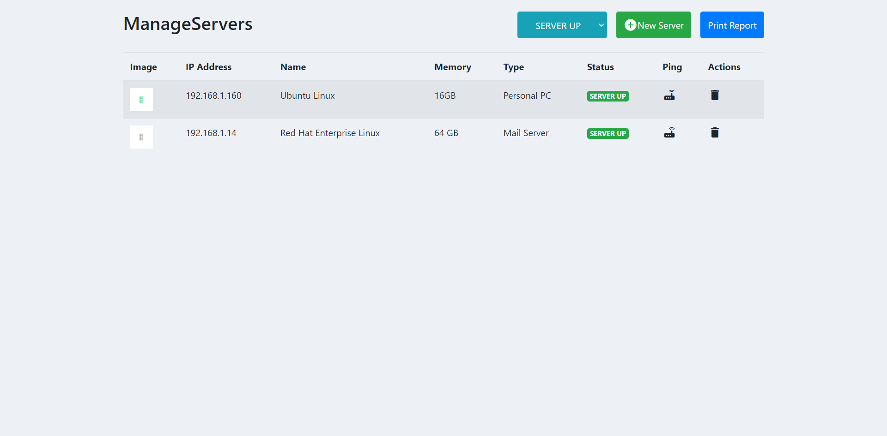

# Server Management

This project is to find if specific servers are up/down

## Features

- User can add a server to the list
- User can view the status of a server (up / down)
- User can ping the server to see if a specific server is up
- User can remove the server info from the list
- User can export the list of servers as .xls file

## Tech Stack

## Screenshots

- Form to add a server info to list
  
- Main page to see a list of all servers
  
- Main page to see a sorted list of servers
  
- exported file for list of servers
  

## Lessons Learned

- To ping the server, we can get help from InetAddress, which is from java.net package
- InetAddress determines the IP address of a host by a hostname using getByName method, and can test whether the address is reachable
- XLSX library helps create .xls files
- XLSX catches table by looking for table tag, picks up all data, creates a workbook, creates a sheet in the workbook, and puts in all the table data into the sheet

